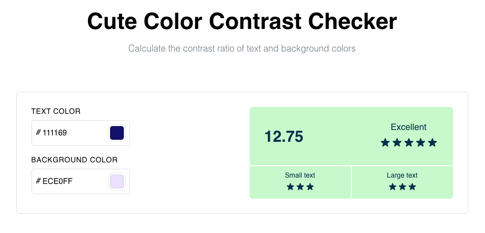
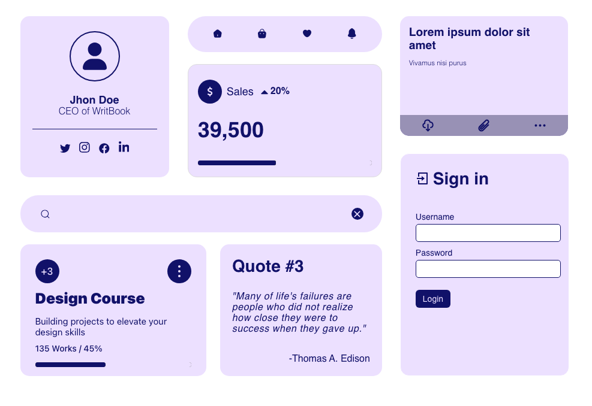
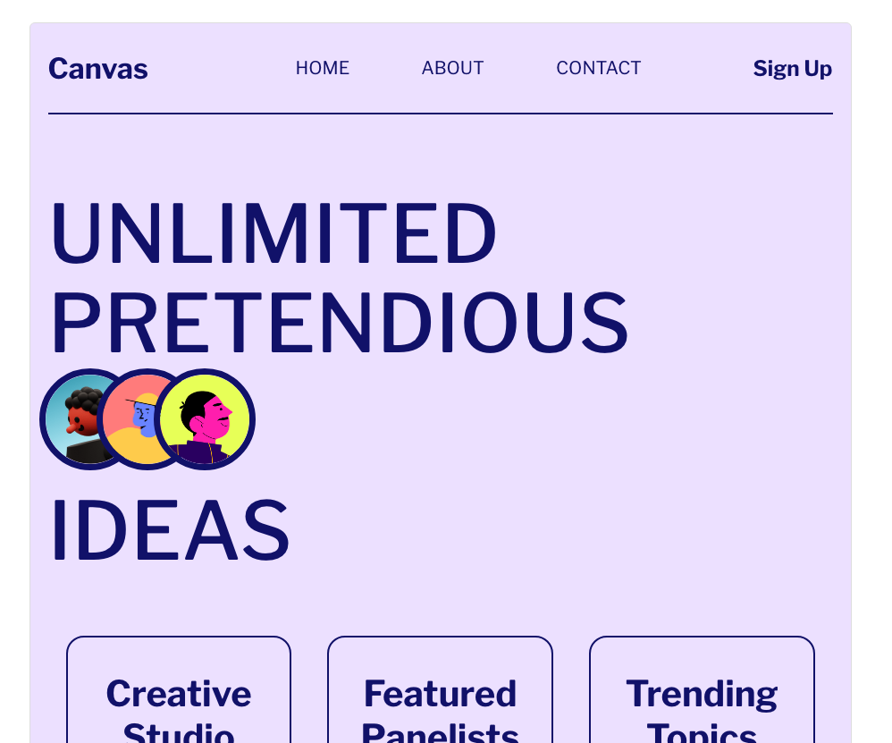

# Cute Color Contrast Checker
With this project I was able to see how color swatches where implimented and learn how luminance is calculated. And was able to refine my skills in display flex and grid to create a bento box style layouts. 

## Feedback on contrast ratio and compliance levels 

## Preview the color combinations with element examples. 

## Preview the color combinations with a site example. 

## Available Scripts

In the project directory, you can run:

### `npm run start`

Runs the app in the development mode.\
Open [http://localhost:3000](http://localhost:3000) to view it in your browser.

The page will reload when you make changes.\
You may also see any lint errors in the console.

